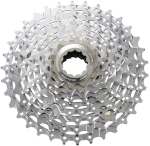
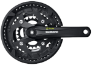
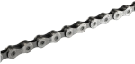
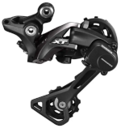
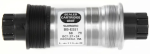

# Painfull drivetrain rebuild on my Merida matts TFS 500 XC

In the name of health, a secondhand mountainbike was purchased a few months ago.  
A few initial trips around the local waterflow and some rides in nearby woods proved to provide enough enjoyment in this new endeavour  
and when the chain broke I was eager enough to also want to replace the front and rear sprockets. 

On this page I will explain how I rebuild my drivetrain on a mountainbike from 2009, or 2008 forgot to ask the previous owner.  
\[[Parts](#parts)\]  /  \[[Assembly](#assembly)\]  /  \[[Solution](#solution)\]  /  \[[Test & results](#test-&-results)\]  

## Parts

### basic drivetrain elements:

| :-- | :-- |
| cassette (in my case 9 speed) |  |
| crankset (3 speed here) |  |
| chain |  | 

  
### The chain gets guided by both:  

| :-- | :-- |
| front derailleur |  |
| rear derailleur |  |

I would also replaced the sprockets in the latter.
  

### "Sadly" enough I also got to learn about:  
Seeing this part should should not have suffered as much as the sprockets I did not opt to change this initially.  

| :-- | :-- |
| crankshaft |  |
  

### As I am used to work on motorcycles but not bycicles I also needed to order a few specific tools for the job ahead.  
- Cassette removal tool  
- Cassette Chainwhip (keeps the cassette in place while removing it)  
- Chain rivetting tool  
- Crank removal tool  
- Bracketplug (for crankshaft removal)  
  
  
## Assemby

Removing most items proved easy enough, no seized items, and removing the cassette and cranks was more than easy enough with the right tools. The cassette was replaced quite easily, the driveside crank however proved to be more of a challenge. The crankset I bought was aimed at a more recent bike than mine, and I could not secure it without fixing it in place.

Checking the difference between the old crankset and the new it was clear that the newer crankset had a lowered attachment point than the old one. Since a bike not being able to be moved forward was clearly not what I was aiming for I got in contact with the support team of the shop where I bought the parts. The friendly support staff asked me a few questions and a specialist provided me a link to a crankshaft, that one would surely fix my issues.  
With the measurements taken during the call and the crankshaft not being of the specs the bike frame offered I was seriously doubting the item would fix my issues, but after a second contact another specialist at the shop assured me that it would be the right part.
  
One purchase later the old crankshaft had to be removed, this one was actually so fixed into the frame that I had to take it to a nearby motorcycle shop to get it loosened with an impact wrench.  
Cleaning out the frame and putting in the new crankshaft actually proved no real help, the crank still needed to be turned in too far to the frame and I could not tune the front derailleur enough, the chain would keep rubbing against it.

## Solution

## Test & results
