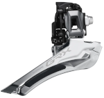

# My first time working on a bycicle: 
# Painfull drivetrain rebuild on my Merida matts TFS 500 XC

In the name of health, a secondhand mountainbike was purchased a few months ago.  
A few initial trips around the local waterflow and some rides in nearby woods proved to provide enough enjoyment in this new endeavour  
and when the chain broke I was eager enough to also want to replace the front and rear sprockets. 

On this page I will explain how I rebuild my drivetrain on a mountainbike from 2009, or 2008 forgot to ask the previous owner.  
\[[Parts](#parts)\]  /  \[[Assembly](#assembly)\]  /  \[[Solution](#solution)\]  /  \[[Result & sources](#result--sources)\]  

## Parts

### basic drivetrain elements:

| :-- | :-- |
| cassette (in my case 9 speed) |  |
| crankset (3 speed here) |  |
| chain |  | 

  
### The chain gets guided by both:  

| :-- | :-- |
| front derailleur |  |
| rear derailleur |  |

I would also replaced the sprockets in the latter.
  

### "Sadly" enough I also got to learn about:  
Seeing this part should should not have suffered as much as the sprockets I did not opt to change this initially.  

| :-- | :-- |
| crankshaft |  |
  

### As I am used to work on motorcycles but not bycicles I also needed to order a few specific tools for the job ahead.  
- Cassette removal tool  
- Cassette Chainwhip (keeps the cassette in place while removing it)  
- Chain rivetting tool  
- Crank removal tool  
- Bracketplug (for crankshaft removal)  
  
  
## Assembly

Removing most items proved easy enough, no seized items, and removing the cassette and cranks was more than easy enough with the right tools. The cassette was replaced quite easily. The chain proved to be too long initially, seems manufacturers send out chains too long to make sure all type of bikes can use them. Using the newly acquired rivetting tool adapting the chain was done almost effortlessly.   

The driveside crank however proved to be more of a challenge. The crankset I bought was aimed at a more recent bike than mine, and I could not secure it without fixing it in place on the old crankshaft. Checking the difference between the old crankset and the new it was clear that the newer crankset had a lowered attachment point than the old one. Since a bike not being able to be moved forward was clearly not what I was aiming for I got in contact with the support team of the shop where I bought the parts. The friendly support staff asked me a few questions and a specialist provided me a link to a crankshaft, that one would surely fix my issues. With the measurements taken during the call (frame width 73mm wide and crankshaft 118mm wide) and the crankshaft not being of the specs the bike frame offered (68/118mm wide) I was seriously doubting the item would fix my issues, but after a second contact another specialist at the shop assured me that it would be the right part.  
  
One purchase later the old crankshaft had to be removed, this one had actually seized into the frame, more than probobly due to age and not being used, so I had to take it to a nearby motorcycle shop to get it loosened with an impact wrench. Cleaning out the frame and putting in the new crankshaft actually proved no real help, the crank still needed to be turned in too far to the frame and I could not tune the front derailleur enough, the chain would keep rubbing against it. Again contact with the support desk was sought, but as the cranks attachment was deeper set into the crank than originally it wasn't odd the size of the crankshaft would need to fit the 73mm frame but would need to be wider than the 118mm the shop kept proposing.  
  
That saturday I sent a mail to the shop to complain about the "specialists", but I also looked around on other shops for a crankshaft that would fit the frame and have a larger shaft in itself, a fitting 73/121 crankshaft was found and ordered. On monday I got a reply from the original shop that they did not have the right crankshaft for me on the webshop, but that another specialist found one in stock and they would send it right away. Looking at the specs of the crankshaft, instead of the original 68/118 they sent me the replacement would now be a 73/121, we all know that won't fit by now. Both new crankshafts arrived on tuesday, so I was out working in the nice weather, with four crankshafts, an old 73/118, a new 73/118, the bad 68/118 and a possible solution, the 73/121mm specced crankshaft. After fitting the newly sent 73/118, the chain would indeed still rub against the front derailleur when it's positioned on the largest of the cassettes' sprockets.
  
The 73/121 crankshaft however reduced that to a very slight rub after tuning the front derailleur only on the largest rear sprocket, apparently the right crankshaft would have been the 73/126mm, but that one is currently out of stock at both shops I ordered from. Having only one unusable sprocket left, I was actually quite happy that I could go for a ride, only one thing left now...   

Tune the derailleurs so that the chain dances around over the sprockets instead of grinding and switching gears unwanted.

## Result & sources

After two inspection runs today, I can say that the bike runs and shifts great, the only issue I could find was the chain "skipping a beat" when going uphill on the more heavy gears, I suspect I need to learn to better rivet my chain as it could be a chainlink that's seized, to be investigated.

I learned quite a bit on the bike's drivetrain and while it was not a frustration free experience, doing this myself surely feels good and the experience (and new tools) help me not to get stranded out on a ride somewhere like last time.
